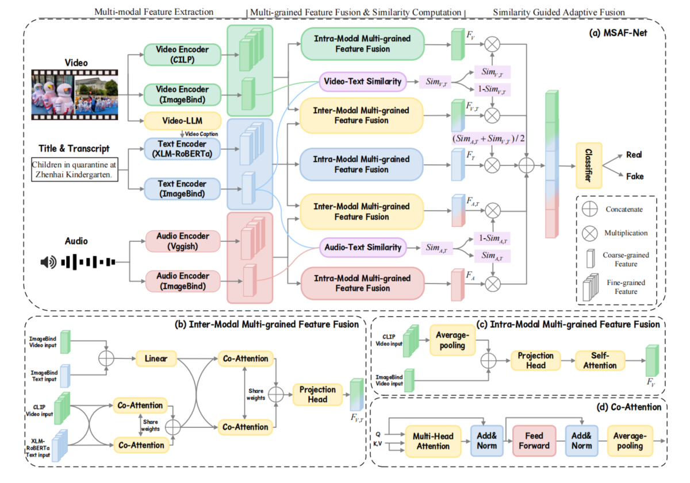

# 🌟 The Official Implementation of MSAF-Net

This is the official code for the [***Multi-modal Similarity Guided Adaptive Fusion Network for Short Video Fake News Detection***](https://doi.org/10.1145/3731715.3733400)

## TODO List
- [x] Code
- [x] Model weights
- [x] Features
- [x] Data preprocessing

## Framework


## Datasets
We provide video IDs for each dataset splits. Due to copyright restrictions, the raw datasets are not included. You can obtain the datasets from their respective original project sites.
+ [FakeSV](https://github.com/ICTMCG/FakeSV)
+ [FakeTT](https://github.com/ICTMCG/FakingRecipe)

## Features & checkpoints
Download the preprocessed features and pretrained checkpoints from [this link](https://pan.baidu.com/s/1l2ENoh89DhhLUKUNvMeN7w?pwd=kkhg) (password: kkhg), and place the /fea or /provided_ckp folders in the MSAF-Net root directory, next to main.py.

## Environment
+ Python 3.8.13
+ PyTorch 1.12.1+cu113
+ CUDA 11.3

# Usage

## Requirement
```python
conda create --name msaf python=3.8
conda activate msaf
pip install -r requirements.txt
```
## Data Preprocessing

This section describes how to preprocess the data and extract the required features for the model.

### ImageBind Features

1. Download the ImageBind pretrained checkpoint from the official source:  
   https://dl.fbaipublicfiles.com/imagebind/imagebind_huge.pth

2. Place the downloaded checkpoint under the following directory:

   /data_process/.checkpoints/

3. Run the following scripts to extract ImageBind features for the two datasets:

   python getImageBind_FakeSV.py
   python getImageBind_FakeTT.py

### Caption Features

We provide the generated captions in the `/data` directory.

Run the following script to extract caption features:

   python get_caption_feature.py

### Other Features

For the extraction of other features, we follow the same preprocessing pipeline as **FakingRecipe**. Please refer to the original implementation for more details.

## Train
```python
# FakeSV

python3 main_MSAF_Net.py --batch_size 64 --lr 4e-5 --dataset fakesv --early_stop 9 --loss_weight 1

# FakeTT

python3 main_MSAF_Net.py --batch_size 128 --lr 5e-5 --dataset fakett --early_stop 12 --loss_weight 2.5
```

## Infer
You can utilize MSAF-Net to infer the authenticity of the samples from the test set by following code:
```python
# Infer the examples from FakeSV

python3 main_MSAF_Net.py --mode inference_test --inference_ckp ./provided_ckp/FakeSV/MSAF_Net_test_0.8697 --dataset fakesv

# Infer the examples from FakeTT

python3 main_MSAF_Net.py --mode inference_test --inference_ckp ./provided_ckp/FakeTT/MSAF_Net_test_0.8145 --dataset fakett
```

## Citation
If you find our research useful, please cite this paper:
```bib
@inproceedings{msaf-net,
title = {Multi-modal Similarity Guided Adaptive Fusion Network for Short Video Fake News Detection},
author = {Shen, Jing and Wang, Yanjia and Wang, Shengze and Zhang, Yuping and Liu, Haibo},
booktitle = {Proceedings of the 2025 International Conference on Multimedia Retrieval},
year = {2025},
doi = {10.1145/3731715.3733400},
publisher = {Association for Computing Machinery},
}

```
